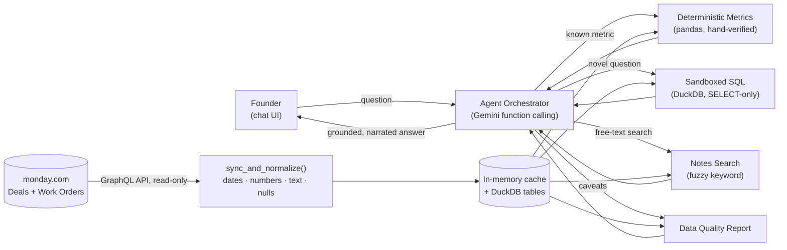
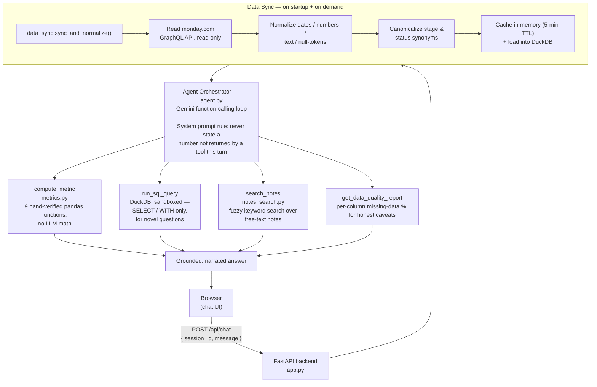

# 🛰️ Skylark BI Agent

### A conversational Business Intelligence agent for monday.com — built for the Skylark Drones Technical Assignment

> Founders shouldn't have to manually pull, clean, and cross-reference monday.com boards to answer
> a question like *"how's our pipeline looking for the energy sector this quarter?"*. This agent
> reads the **Deals** and **Work Orders** boards live, reasons about the question, and answers in
> plain business language — with honest caveats when the underlying data is incomplete.

**Live demo:** `[ADD YOUR HOSTED URL HERE]`
**Decision Log:** [`DECISION_LOG.md`](./DECISION_LOG.md) (2-page assumptions/trade-offs doc)
**Screenshots:** [see below](#-screenshots)

---

## Table of Contents

1. [Problem Statement](#1-problem-statement)
2. [Solution at a Glance](#2-solution-at-a-glance)
3. [Approaches Considered](#3-approaches-considered)
4. [Chosen Architecture](#4-chosen-architecture)
5. [Tech Stack & Justification](#5-tech-stack--justification)
6. [Data Model](#6-data-model)
7. [Deterministic Metrics Catalogue](#7-deterministic-metrics-catalogue)
8. [Sample Conversations](#8-sample-conversations)
9. [Data Resilience Strategy](#9-data-resilience-strategy)
10. [Error Handling](#10-error-handling)
11. [Project Structure](#11-project-structure)
12. [Running the App](#12-running-the-app)
13. [Screenshots](#13-screenshots)
14. [Deliverables Checklist](#14-deliverables-checklist)
15. [Requirement Coverage Matrix](#15-requirement-coverage-matrix)
16. [Known Limitations & Roadmap](#16-known-limitations--roadmap)
17. [Credits](#17-credits)

---

## 1. Problem Statement

Skylark Drones posed the following challenge: founders need fast, trustworthy answers to
business questions that span two monday.com boards — **Deals** (sales pipeline) and
**Work Orders** (project execution) — without manually exporting, cleaning, and cross-referencing
spreadsheets every time. The data is real-world messy: inconsistent date formats, free-text
sector/client naming, missing fields. The brief explicitly required:

- Dynamic, read-only integration with monday.com (MCP or API) — **never** querying the original
  CSV/Excel files at answer time.
- Graceful handling of missing/inconsistent data, with data-quality caveats surfaced to the user.
- A conversational interface capable of interpreting founder-level questions and asking for
  clarification when genuinely ambiguous.
- Business-intelligence answers (revenue, pipeline health, sector performance, operational
  metrics) that combine both boards when needed — insight, not just numbers.
- An open-ended bonus: "help prepare data for leadership updates."

## 2. Solution at a Glance

An agent that treats **monday.com as the single source of truth**, syncs it into a clean
in-memory data layer on a short TTL, and answers questions through a **tool-using LLM loop**:
common founder questions are answered by pre-built, hand-verified metric functions (never
LLM arithmetic); anything novel falls back to LLM-generated, sandboxed SQL against that same
clean data. The model never states a number it didn't get from a tool call in that turn.



## 3. Approaches Considered

Before settling on the final design, several implementation strategies were weighed for each
major decision. This section documents the options — not just the winner — since the assignment
explicitly rewards showing how ambiguity was navigated.

### 3.1 monday.com integration: MCP server vs. direct API

| Option | Pros | Cons | Chosen |
|---|---|---|---|
| **monday.com MCP server** | Zero-boilerplate tool definitions; plugs directly into an MCP-aware agent runtime | Less control over pagination/query shape; an extra moving part to configure and host correctly under a tight deadline | No |
| **Direct GraphQL API (`api.monday.com/v2`)** | Full control over `items_page` pagination, column selection, and error handling; one dependency (`requests`); easy to unit-test | Slightly more code to write up front | Yes |

The assignment explicitly allows either. Direct API was chosen because it keeps the whole stack
in one predictable Python process — important given the 6-hour timeline — while remaining a
one-file swap (`monday_client.py`) if a hosted MCP server is preferred later.

### 3.2 Agent orchestration pattern

| Option | Pros | Cons | Chosen |
|---|---|---|---|
| Single-shot prompt (stuff all data into one LLM call, ask it to answer) | Simplest to build | LLM does its own arithmetic on retrieved rows → unreliable numbers, no true "read live data" story at scale | No |
| Hand-rolled router (regex/keyword intent classifier) + separate numeric verifier pass | Fully deterministic control flow | Brittle to phrasing; significant custom code to reach the same reliability a native tool-loop gets for free | No |
| **Native function-calling / tool-use loop (ReAct-style)** | Model decides which tool to call based on the actual question; tool outputs are the only source of numbers; naturally handles multi-turn clarification | Requires careful system-prompt discipline ("never state an unsourced number") | Yes |
| Full agent framework (LangChain / LlamaIndex / CrewAI) | Batteries-included agents, memory, retrievers | Heavier dependency surface and more to debug than needed for two data sources in a time-boxed assignment | No |

The native tool-calling loop was chosen: it gets ReAct-style behavior (reason → call a tool →
observe → answer) directly from the model API, with the actual math staying in Python.

### 3.3 Executing novel (non-catalogued) questions

| Option | Pros | Cons | Chosen |
|---|---|---|---|
| LLM-generated raw Python, `exec()`'d against a dataframe | Maximum flexibility | Large unsafe surface area (arbitrary code execution) even with a restricted sandbox | No |
| **LLM-generated SQL against DuckDB** | SQL errors are structured and easy to self-heal; trivially restricted to `SELECT`/`WITH` only; DuckDB is embedded, no infra | Marginally less expressive than raw Python for exotic transforms | Yes |
| Deterministic metrics only, no fallback | Zero risk | Fails on any question outside the pre-built catalogue — too rigid for open-ended founder questions | No |

**Hybrid, in priority order:** deterministic metrics first, generated SQL second. This is the
core reliability decision in the whole system — see [§4](#4-chosen-architecture).

### 3.4 Retrieval strategy for free-text notes

| Option | Pros | Cons | Chosen |
|---|---|---|---|
| No retrieval (ignore notes fields) | Simple | Misses genuinely useful signal ("which deals mentioned pricing concerns") | No |
| Full embeddings-based RAG (`chromadb` + `sentence-transformers`/hosted embeddings) | Best semantic recall, scales to large corpora | Extra dependency, an indexing/re-embedding step, another place retrieval can silently go wrong — for a few hundred rows, doesn't earn its complexity | No |
| **Lightweight fuzzy/keyword search (`rapidfuzz`)** | Zero extra infra, no embedding API cost, covers the demo's actual note volume well | Weaker on paraphrase / synonym-heavy queries than real embeddings | Yes |

Explicitly scoped: retrieval is used **only** where it earns its keep (free-text search).
Schema and business-glossary context are small and static, so they're included directly in the
system prompt rather than retrieved — retrieval there would add a failure mode (bad retrieval)
for no benefit at this data scale.

### 3.5 Frontend

| Option | Pros | Cons | Chosen |
|---|---|---|---|
| React SPA | Rich component ecosystem | Build tooling (npm/vite) eats setup time against a hard deadline | No |
| Streamlit | Fast to prototype in Python | Harder to get a genuinely custom, polished chat UI; couples UI and backend process | No |
| **Vanilla HTML/CSS/JS, single file, served by the backend** | Zero build step, one process to deploy, full control over the chat UX | Less reusable as components grow | Yes |

### 3.6 Backend framework

**FastAPI** over Flask or Node/Express — async-friendly, automatic OpenAPI docs at `/docs` (handy
for testing the agent independent of the UI), and Pydantic request/response validation for very
little boilerplate.

### 3.7 LLM provider

| Option | Notes |
|---|---|
| Anthropic Claude (initial scaffold) | Strong tool-use support; used in early prototyping |
| OpenAI GPT | Also a valid function-calling option |
| **Google Gemini API — Selected for the final submission** | Native function calling with the same tool-loop pattern; generous free-tier quota that comfortably covers a time-boxed assignment plus live grading/testing; low latency, which matters for a conversational UI. |

The orchestration pattern (tools, system prompt, deterministic-metrics-first priority) is
provider-agnostic by design — `agent.py` isolates all model-specific code behind one module, so
swapping the LLM client was a contained change rather than a rearchitecture.

### 3.8 Hosting

Render was chosen over Railway/Replit for the hosted prototype: a generous free tier, a simple
`Procfile`-style start command, and straightforward environment-variable/secret-file management
for `column_mapping.json`. `ngrok` is documented as a same-day fallback if hosting setup runs
short on time (see [§13](#13-deployment)).

## 4. Chosen Architecture



**Why deterministic-metrics-first matters:** the nine most common founder questions (pipeline by
sector, win rate, overdue work orders, etc.) never depend on freshly generated code — they run
through plain, tested pandas functions. Only genuinely novel questions fall through to
LLM-generated SQL, and even then the model can only run a single read-only `SELECT`/`WITH`
statement (enforced in `tools._is_safe_select`) — never inserts, updates, drops, or stacked
statements.

## 5. Tech Stack & Justification

| Layer | Choice | Why |
|---|---|---|
| LLM / agent brain | **Google Gemini API** (function calling) | Free-tier friendly for a graded take-home; native tool-use; low latency |
| Backend | **Python 3.11 + FastAPI** | One runtime for the monday.com client, pandas, and the agent loop; async-ready; auto docs at `/docs` |
| monday.com integration | **GraphQL API v2** via `requests` | Full pagination/column control, read-only, no extra infra |
| Data cleaning | **pandas** + `python-dateutil` + `rapidfuzz` | Battle-tested for messy real-world tabular data |
| Query fallback | **DuckDB** (embedded, in-process SQL) | Naturally sandboxed, zero infra, fast on small-to-mid data |
| Notes search | **rapidfuzz** keyword/fuzzy matching | Covers the demo corpus without an embeddings dependency (see [§3.4](#34-retrieval-strategy-for-free-text-notes)) |
| Frontend | **Vanilla HTML/CSS/JS**, single file | No build step, one deployable service, full UX control |
| Hosting | **Render** (free tier) | Fastest path to a public, testable link |

## 6. Data Model

Both boards are normalized into a consistent internal shape before anything else touches them:

```text
Deal
  id, name, client, sector, stage (Prospecting|Proposal|Negotiation|Won|Lost),
  value, probability (0-1), expected_close_date, actual_close_date, owner, notes

WorkOrder
  id, name, client, sector, project_name,
  status (Not Started|In Progress|Completed|On Hold),
  start_date, planned_end_date, actual_end_date, owner,
  budget, revenue_recognized, notes
```

Column *titles* on the actual monday.com boards can be anything — `column_mapping.json` maps
each logical field above to the board's real (opaque) column ID, discovered once via
`discover_columns.py`.

## 7. Deterministic Metrics Catalogue

| Metric | Board | What it answers |
|---|---|---|
| `pipeline_by_sector` | Deals | Open pipeline value & deal count, grouped by sector |
| `weighted_pipeline` | Deals | Pipeline value weighted by close probability |
| `win_rate` | Deals | Won ÷ (Won + Lost), optionally by sector / since a date |
| `avg_deal_cycle_time` | Deals | Average days between expected and actual close, for Won deals |
| `stalled_deals` | Deals | Open deals sitting past their expected close date |
| `work_order_completion_rate` | Work Orders | Share of work orders marked Completed |
| `on_time_delivery_pct` | Work Orders | Share of completed work orders finished on/before plan |
| `overdue_work_orders` | Work Orders | Non-completed work orders already past their planned end date |
| `revenue_vs_cost` | Work Orders | Recognized revenue vs. budget, and the resulting margin |

Every function is plain pandas, unit-testable in isolation, and returns JSON-friendly native
types plus a `note` field when the result is null due to insufficient data.

## 8. Sample Conversations

**Straightforward metric**
> **Founder:** How's our pipeline looking for the energy sector this quarter?
> **Agent:** Open energy-sector pipeline is **$340K across 6 deals**. Two deals ($120K combined)
> are past their expected close date, so the real near-term number may be softer than it looks.
> *(4% of deals are missing a sector — small enough not to change this materially.)*

**Clarification needed**
> **Founder:** What's our win rate?
> **Agent:** Do you want that across all sectors, or a specific one — and all-time or a recent
> window (e.g. the last 2 quarters)?

**Cross-board / novel question (SQL fallback)**
> **Founder:** Which clients have an open deal *and* an overdue work order right now?
> **Agent:** Three clients: Acme Corp, Northwind Energy, and Delta Mining — each has at least one
> open deal and one work order past its planned end date. Worth a check-in before those renewals
> come up.

**Leadership update (bonus feature)**
> **Founder:** Prepare a leadership update on pipeline and delivery health.
> **Agent:** *(returns a short, structured brief — pipeline health, notable wins/risks,
> operational status, and flagged data gaps — written to paste directly into an update email.)*

## 9. Data Resilience Strategy

- **Null normalization:** `"N/A"`, `"-"`, `"TBD"`, blanks, etc. all collapse to a real `None`
  rather than being treated as zero or a literal string.
- **Date parsing:** `dateutil.parser` with fuzzy matching absorbs inconsistent formats
  (`3/1/25`, `March 1 2025`, `2025-03-01`, ...) into a single ISO format.
- **Number cleaning:** currency symbols, commas, and stray whitespace are stripped before
  casting to float; unparseable values become `None`, not a crash.
- **Text/taxonomy canonicalization:** case/whitespace normalization plus a small synonym map
  (`"closed won"` → `Won`, `"in progress"`/`"ongoing"` → `In Progress`, etc.), extendable in
  `data_sync.py`.
- **Data-quality reporting:** row counts and per-column missing-data percentages are computed at
  every sync and surfaced to the agent as a tool (`get_data_quality_report`), so caveats in
  answers are backed by an actual measurement, not a guess.

## 10. Error Handling

- **monday.com API failures** (auth, rate limits, board not found) raise a clear `RuntimeError`
  message rather than a raw stack trace; the chat endpoint returns a readable 500 with detail.
- **SQL fallback is sandboxed:** only a single read-only `SELECT`/`WITH` statement is permitted;
  writes, `DROP`/`ALTER`, and stacked statements are rejected before execution.
- **Tool-call budget:** the agent loop caps at 6 tool round-trips per turn to avoid runaway
  loops; if exceeded, it asks the user to narrow the question instead of hanging.
- **Empty results:** metric functions return a `note` explaining *why* a result is null
  (e.g. "no completed work orders with both a planned and actual end date") instead of a bare
  `None`.
- **Frontend:** network failures and non-2xx responses surface as an inline system message in
  the chat log rather than failing silently.

## 11. Project Structure

| Path | Description |
|---|---|
| `backend/app.py` | FastAPI app: `/api/chat`, `/api/refresh`, `/api/health` |
| `backend/agent.py` | Gemini function-calling orchestrator (the agent loop) |
| `backend/tools.py` | Tool schema + dispatcher |
| `backend/metrics.py` | 9 deterministic business metrics (pandas) |
| `backend/data_sync.py` | monday.com sync, normalization, caching, DuckDB load |
| `backend/normalize.py` | Date / number / text / null cleaning helpers |
| `backend/notes_search.py` | Fuzzy keyword search over notes fields |
| `backend/monday_client.py` | Read-only GraphQL wrapper |
| `backend/discover_columns.py` | CLI: list a board's real column IDs |
| `backend/config.py` | Env vars + `column_mapping.json` loader |
| `backend/column_mapping.example.json` | Template — copy to `column_mapping.json` and fill in |
| `backend/requirements.txt`, `.env.example`, `Procfile` | Dependencies, environment template, process file |
| `frontend/index.html` | Single-file chat UI |
| `README.md` | This file |
| `DECISION_LOG.md` | Assumptions, trade-offs, leadership-update interpretation |

## 12. Running the App

Download `requirements.txt` from the `backend/` folder and install the dependencies:

```bash
pip install -r requirements.txt
```

Start the server:

```bash
uvicorn app:app --host 0.0.0.0 --port $PORT
```

This runs the FastAPI backend (`app.py`), which serves the `/api/chat` endpoint and the frontend
chat UI in one process. `$PORT` can be set to any available port (e.g. `8000`).

Once running, open the app at:

```
http://localhost:8000
```

The chat UI loads directly from the backend — no separate frontend process needed.

## 13. Screenshots

> Add screenshots to a `screenshots/` folder next to this README, then reference them below.

| Chat interface | Metric answer with caveat | Leadership update |
|---|---|---|
|  |  |  |

## 15. Deliverables Checklist

- **Hosted prototype** — deployed on Render, link at the top of this README (fill in after
  deploying).
- **Decision Log** (2-page max) — [`DECISION_LOG.md`](./DECISION_LOG.md): key assumptions,
  trade-offs and why, what I'd do with more time, and how "leadership updates" was
  interpreted.
- **Source code (ZIP)** — this repository, with this README covering architecture and
  monday.com setup end-to-end.
- **Conversational interface** — chat UI + multi-turn session memory, clarification
  questions when genuinely ambiguous.
- **monday.com integration via API** — read-only GraphQL, dynamic (never reads the source
  CSVs at query time).
- **Graceful error handling** — API failures, sandboxed SQL, empty results, tool-budget
  limits (see [§10](#10-error-handling)).
- **Tech stack justified** — [§5](#5-tech-stack--justification) and
  [§3](#3-approaches-considered).

## 16. Requirement Coverage Matrix

| Assignment requirement | Where it's implemented |
|---|---|
| Connect to monday.com via API, handle auth | `monday_client.py`, `config.py` |
| Handle missing/null values gracefully | `normalize.py::clean_null`, applied throughout `data_sync.py` |
| Normalize inconsistent dates/naming/text | `normalize.py`, `STAGE_SYNONYMS`/`STATUS_SYNONYMS` in `data_sync.py` |
| Meaningful results despite incomplete data | metric functions return an explanatory `note` instead of failing on nulls |
| Communicate data-quality caveats | `get_data_quality_report` tool + system-prompt instruction to cite it |
| Interpret founder-level questions | `agent.py` system prompt + Gemini function calling |
| Ask clarifying questions when needed | `agent.py` system prompt, rule 4 |
| Revenue / pipeline / sector / operational metrics | `metrics.py` (9 functions, [§7](#7-deterministic-metrics-catalogue)) |
| Query across both boards | `run_sql_query` fallback joins `deals` and `work_orders` in DuckDB |
| Context and insight, not just numbers | agent narration step, always paired with the sourcing figure |
| Prepare data for leadership updates (bonus) | dedicated system-prompt instruction, reuses the same grounded tool path — see [§8](#8-sample-conversations) and `DECISION_LOG.md` |
| Do not hardcode/read CSVs at query time | CSVs are only ever used once, to import into monday.com; the app has no code path that reads them |

## 17. Known Limitations & Roadmap

- Session history and the data cache are in-memory only — they reset on redeploy/restart. A
  production version would move both to a real store (Postgres/Redis).
- Notes search is fuzzy keyword matching, not embeddings-based semantic search — a deliberate
  scope cut under the time limit (see [§3.4](#34-retrieval-strategy-for-free-text-notes) and
  `DECISION_LOG.md`).
- Cross-board linking (deal ↔ work order) is a best-effort join on client name via the SQL
  fallback rather than a confidence-scored resolver against a native Connect-Boards column.
- No automated eval set yet; answers were spot-checked manually against the raw data during
  development. A 10–15 question hand-verified eval set is the natural next addition.

## 18. Credits

Built for the **Skylark Drones** Technical Assignment — Monday.com Business Intelligence Agent.
Data sources: `Deal Funnel Data.xlsx`, `Work_Order_Tracker Data.xlsx` (imported into monday.com
per [§12](#12-setup--installation), never read directly by the running application).
